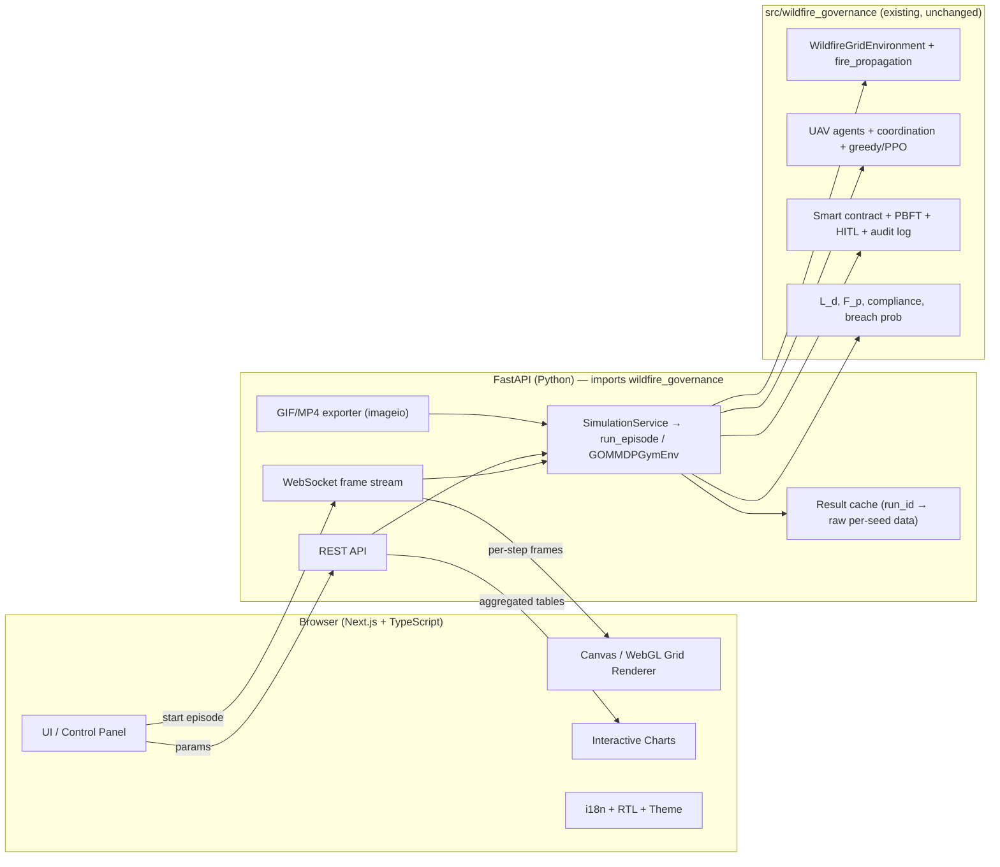
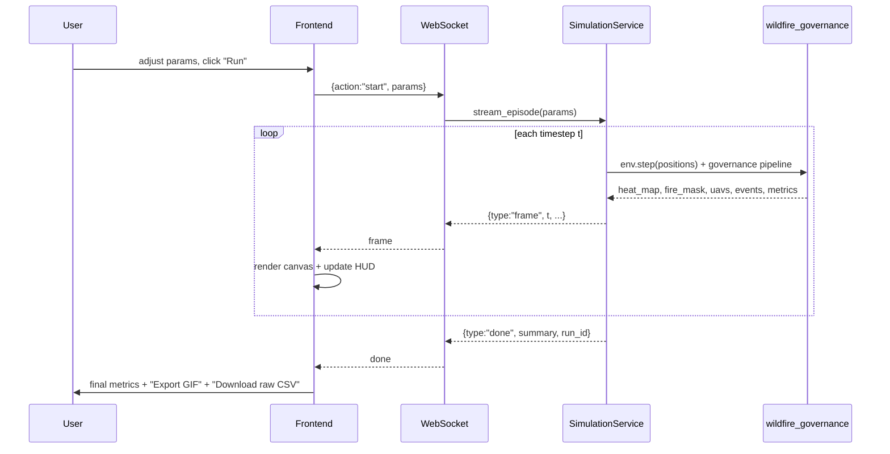
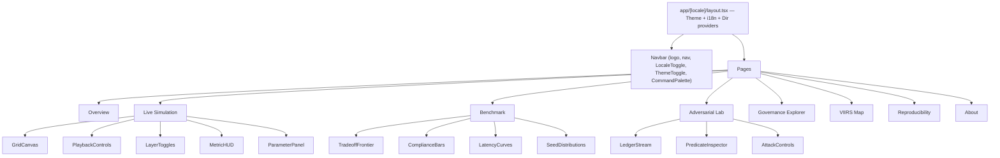

# Dashboard Guide — Governance-Constrained Agentic AI for Wildfire Monitoring

**An end-to-end design and implementation blueprint for a publication-grade, interactive research dashboard (GOMDP / PPO-GOMDP / Blockchain-Enforced HITL).**

> Audience: the project authors and any engineer/designer who will build the dashboard.
> Goal: a dashboard good enough to demo at AAAI — aesthetic, bilingual (Arabic + English), themeable (dark/light), fully interactive, and animated (PyroRL-style episode playback), while remaining **scientifically honest and reproducible**.

---

## Table of Contents

1. [Purpose, Scope & Success Criteria](#1-purpose-scope--success-criteria)
2. [Design Principles](#2-design-principles)
3. [Feature Matrix](#3-feature-matrix)
4. [System Architecture](#4-system-architecture)
5. [Technology Stack (and why)](#5-technology-stack-and-why)
6. [Backend: turning the simulation into a live service](#6-backend-turning-the-simulation-into-a-live-service)
7. [Frontend: application structure](#7-frontend-application-structure)
8. [Information Architecture — the eight screens](#8-information-architecture--the-eight-screens)
9. [Visual Design System](#9-visual-design-system)
10. [The Animated Simulation Viewer (the "GIF" centerpiece)](#10-the-animated-simulation-viewer-the-gif-centerpiece)
11. [Interactivity Model](#11-interactivity-model)
12. [Data Visualizations (per paper table/figure)](#12-data-visualizations-per-paper-tablefigure)
13. [Internationalization: Arabic + English + RTL](#13-internationalization-arabic--english--rtl)
14. [Theming: Dark & Light](#14-theming-dark--light)
15. [Accessibility (WCAG 2.1 AA)](#15-accessibility-wcag-21-aa)
16. [Performance Engineering](#16-performance-engineering)
17. [Responsive Design](#17-responsive-design)
18. [State Management & Data Flow](#18-state-management--data-flow)
19. [Scientific Integrity & Reproducibility (read this before you wire anything)](#19-scientific-integrity--reproducibility)
20. [Repository Layout](#20-repository-layout)
21. [Implementation Roadmap](#21-implementation-roadmap)
22. [Deployment](#22-deployment)
23. [Testing & QA](#23-testing--qa)
24. [AAAI Demo Track Guidance](#24-aaai-demo-track-guidance)
25. [Appendices](#25-appendices)

---

## 1. Purpose, Scope & Success Criteria

### 1.1 What the dashboard is for

The dashboard is the **interactive face** of the paper *"Governance-Constrained Agentic AI: A Governance-Invariant MDP Framework with Blockchain-Enforced Human Oversight for Safety-Critical Wildfire Monitoring."* It has to do three jobs at once:

1. **Explain the idea** — make the GOMDP concept (safety enforced at the environment boundary, not as a soft penalty) legible to a reviewer in 60 seconds.
2. **Prove the idea** — let a user *run* the simulation with their own parameters and watch governance actually block non-compliant alerts and adversarial injections in real time.
3. **Present the evidence** — reproduce every table and figure from the paper as an interactive, downloadable, drill-down visualization.

### 1.2 Success criteria (measurable)

| Criterion | Target |
|---|---|
| Time-to-first-insight for a new visitor | ≤ 60 s (guided landing + auto-playing demo) |
| Live simulation frame rate (100×100 grid, 20 UAVs) | ≥ 20 fps in-browser |
| Cold-start of a live episode (backend) | ≤ 2 s to first frame |
| Languages | English + Arabic, full RTL, no layout breakage |
| Themes | Dark + Light, system-aware, persisted |
| Lighthouse (Performance / Accessibility / Best Practices) | ≥ 90 each |
| Accessibility | WCAG 2.1 AA; keyboard-navigable; reduced-motion honored |
| Reproducibility | Every number on screen is either (a) computed live from user params or (b) explicitly labeled "paper reference" |

---

## 2. Design Principles

1. **Show, don't tell.** The hero is an animated grid where fire spreads, UAVs patrol, and alerts either fire (with a cryptographic certificate) or get blocked. Prose is secondary.
2. **Honesty is a feature.** Live runs are labeled "live"; paper values are labeled "reference." Seeds, confidence intervals, and raw data are always one click away. This is what earns reviewer trust.
3. **Restraint over spectacle.** Wildfire aesthetics (ember, ash, smoke) are used as *accents* over a calm, scientific neutral base — not a flaming skeuomorphic theme. AAAI reviewers respond to clarity, not decoration.
4. **Every pixel earns its place.** No chartjunk, no 3D pie charts, no gratuitous gradients on data marks.
5. **Bilingual and themeable from day one.** i18n and theming are architectural decisions, not a coat of paint added later. Retrofitting RTL is painful; design for it from the first commit.
6. **Progressive disclosure.** A newcomer sees a clean overview; an expert can open the governance predicate inspector, the blockchain ledger stream, and the per-seed distributions.
7. **Deterministic where it matters.** Same seed + same params → same episode, every time. The scrubber can replay any frame.

---

## 3. Feature Matrix

| # | Feature | Priority | Screen(s) |
|---|---|---|---|
| F1 | Live animated episode viewer (fire + UAVs + alerts) | P0 | Live Simulation |
| F2 | Interactive parameter panel (grid size, N UAVs, sectors, τ, seed, policy, …) | P0 | Live Simulation, Adversarial |
| F3 | Playback controls (play/pause/step/speed/scrub) | P0 | Live Simulation |
| F4 | Real-time metric HUD (L_d, F_p, compliance %, alerts) | P0 | Live Simulation |
| F5 | GIF / MP4 export of an episode (PyroRL-style) | P0 | Live Simulation |
| F6 | Method comparison / benchmark explorer (Table 1 & 2) | P0 | Benchmark |
| F7 | Adversarial lab: spoofing, injection, Byzantine faults, live ledger | P0 | Adversarial |
| F8 | Governance/blockchain explorer: predicate inspector + audit log stream | P1 | Governance |
| F9 | Tradeoff frontier & scalability (Fig 3, Fig 5) with animated sweep | P1 | Benchmark |
| F10 | Real-world VIIRS map mode (California / Mediterranean / NSW) | P1 | VIIRS |
| F11 | Reproducibility panel: seeds, CIs, raw CSV download, "live vs paper" diff | P0 | Reproducibility |
| F12 | Arabic/English toggle + full RTL | P0 | Global |
| F13 | Dark/Light theme toggle (system-aware) | P0 | Global |
| F14 | Split-screen A/B mode (e.g., PPO-GOMDP vs Adaptive-AI synchronized) | P1 | Live Simulation |
| F15 | Shareable permalink encoding all parameters | P1 | Global |
| F16 | Guided tour / onboarding + "explain this" tooltips → paper equations | P1 | Global |
| F17 | Keyboard shortcuts + command palette | P2 | Global |
| F18 | Multi-seed batch run with distribution plots | P1 | Benchmark, Reproducibility |

---

## 4. System Architecture

The dashboard is a **thin, beautiful frontend** over a **backend that runs the real `wildfire_governance` package**. The frontend never fabricates numbers; it renders what the backend computes.



**Frame streaming sequence (live episode):**



Two decoupling benefits: (1) the frontend can be developed against a mocked WebSocket; (2) the backend stays a thin adapter so the *science* lives in the existing package, not the UI.

---

## 5. Technology Stack (and why)

### 5.1 Recommended (premium) stack

| Layer | Choice | Why |
|---|---|---|
| Frontend framework | **Next.js 14 (App Router) + TypeScript** | SSR/SSG for a fast, SEO-friendly landing; file-based routing; first-class i18n via `[locale]` segment |
| Styling | **Tailwind CSS + CSS variables** | Token-driven theming (dark/light) and RTL utilities without fighting a component library |
| Components | **shadcn/ui (Radix primitives)** | Accessible-by-default, unstyled-then-tokenized, easy to theme; not a heavyweight design lock-in |
| Motion | **Framer Motion** | Declarative, honors `prefers-reduced-motion`, smooth panel/route transitions |
| Grid renderer | **HTML Canvas 2D** (upgrade path: **WebGL via regl / PixiJS / deck.gl**) | 100×100 = 10k cells at 20+ fps is trivial on Canvas; WebGL for very large grids or map overlays |
| Charts | **visx** (or **Recharts** for speed) + **Plotly** for the 3D/interactive frontier | visx = full control + theme-aware; Plotly for downloadable scientific plots |
| Maps (VIIRS) | **deck.gl + MapLibre GL** (open-source, no Mapbox token) | GPU-accelerated geospatial fire-detection layers |
| i18n | **next-intl** (or `i18next`) | Locale routing, ICU message format, RTL-aware |
| State | **Zustand** + **TanStack Query** | Zustand for UI/sim state, Query for server data caching/retries |
| Backend | **FastAPI + Uvicorn** | Native `async` WebSockets; imports `wildfire_governance` directly; auto OpenAPI docs |
| Streaming | **WebSocket** (binary frames for heat maps) | Low-latency per-step push; typed arrays keep payloads small |
| GIF/MP4 | **imageio + matplotlib** (server) and **gif.js** (client) | Server path matches PyroRL exactly (great for paper figures); client path for instant download |
| Packaging | **Docker Compose** (frontend + backend) | One-command reproducible demo; fits the repo's existing `docker-compose.yml` |

### 5.2 Fast-track alternative (if you have no frontend bandwidth)

If a React build is out of scope for the deadline, ship a **Dash (Plotly) + FastAPI** or **Streamlit** version first, then upgrade. Ranked:

| Option | Pros | Cons | Verdict |
|---|---|---|---|
| **Dash (Plotly)** | Python-only; good scientific charts; callbacks; can animate frames | RTL/Arabic and premium aesthetics need custom CSS; animation less smooth than Canvas | **Best Python-only path** |
| **Streamlit** | Fastest to a working demo | Weak for custom aesthetics, RTL, true real-time animation; re-runs whole script | Prototype only |
| **Panel/HoloViz** | Powerful scientific dashboards | Steeper theming; smaller ecosystem | Situational |

> **Recommendation:** Build the **Next.js + FastAPI** stack for the AAAI-quality target. Keep a minimal Dash version in `dashboard/dash_prototype/` as a fallback and for quick internal sanity checks. This guide assumes the premium stack unless noted.

---

## 6. Backend: turning the simulation into a live service

The backend is an **adapter**. It does not re-implement any science; it imports the existing package and streams state. The single source of episode truth is `experiments/utils/runner.py::run_episode` and `src/wildfire_governance/rl/gomdp_env.py::GOMMDPGymEnv`.

### 6.1 Endpoints

| Method | Path | Purpose |
|---|---|---|
| `GET` | `/api/health` | Liveness/readiness |
| `GET` | `/api/config/schema` | Parameter schema (names, ranges, defaults, units, i18n keys) so the control panel renders dynamically |
| `GET` | `/api/methods` | List of methods/configs with metadata (color, enforcement type, paper table) |
| `WS` | `/ws/simulate` | Stream a single live episode frame-by-frame |
| `POST` | `/api/benchmark` | Run a multi-seed comparison for selected methods; returns aggregated mean/std/CI **computed live** |
| `POST` | `/api/export/gif` | Server-side GIF/MP4 render of an episode (imageio) |
| `GET` | `/api/runs/{run_id}` | Fetch stored raw per-seed results for a completed run |
| `GET` | `/api/paper-results/{table}` | Serve committed `results/paper/*.csv`, **explicitly labeled reference** |
| `GET` | `/api/paper-results/{table}/diff/{run_id}` | Diff a live run against paper reference (honest reproducibility view) |

### 6.2 Parameter schema (drives the control panel)

Expose this from `/api/config/schema` so the UI, i18n, and validation all read one source:

```python
# dashboard/backend/schema.py
PARAM_SCHEMA = {
    "grid_size":        {"type": "int",   "min": 20, "max": 200, "step": 10, "default": 100, "unit": "cells", "i18n": "param.grid_size"},
    "n_uavs":           {"type": "int",   "min": 1,  "max": 60,  "step": 1,  "default": 20,  "unit": "UAVs",  "i18n": "param.n_uavs"},
    "n_sectors":        {"type": "int",   "min": 4,  "max": 100, "step": 1,  "default": 25,  "unit": "Z",     "i18n": "param.n_sectors"},
    "n_timesteps":      {"type": "int",   "min": 100,"max": 5000,"step": 100,"default": 3000,"unit": "steps", "i18n": "param.n_timesteps"},
    "tau":              {"type": "float", "min": 0.5,"max": 0.99,"step": 0.01,"default": 0.80,"unit": "τ",     "i18n": "param.tau"},
    "seed":             {"type": "int",   "min": 0,  "max": 9999,"step": 1,  "default": 0,   "unit": "",      "i18n": "param.seed"},
    "policy":           {"type": "enum",  "options": ["greedy", "ppo"], "default": "greedy", "i18n": "param.policy"},
    "method":           {"type": "enum",  "options": ["ppo_gomdp","greedy_gomdp","central_sig","ppo_cmdp","adaptive_ai","static"], "default": "ppo_gomdp", "i18n": "param.method"},
    # Adversarial
    "attack_type":      {"type": "enum",  "options": ["none","spoofing","spoofing_strategic","injection","byzantine"], "default": "none", "i18n": "param.attack"},
    "p_spoof":          {"type": "float", "min": 0.0,"max": 0.5, "step": 0.01,"default": 0.0, "unit": "p",     "i18n": "param.p_spoof"},
    "n_byzantine":      {"type": "int",   "min": 0,  "max": 3,   "step": 1,  "default": 0,   "unit": "f",     "i18n": "param.n_byzantine"},
    "p_drop":           {"type": "float", "min": 0.0,"max": 0.3, "step": 0.01,"default": 0.0, "unit": "p",     "i18n": "param.p_drop"},
    "sensor_failure_rate":{"type":"float","min": 0.0,"max": 0.4, "step": 0.05,"default": 0.0, "unit": "%",     "i18n": "param.sensor_fail"},
    "hitl_error_rate":  {"type": "float", "min": 0.0,"max": 0.2, "step": 0.01,"default": 0.05,"unit": "p_err", "i18n": "param.hitl_err"},
}
```

> **Guardrail:** cap `grid_size × n_timesteps` server-side for the live path (e.g., grid ≤ 200, steps ≤ 5000) so a user cannot DoS the demo. Heavy runs (20 seeds × 3000 steps) go through `/api/benchmark` as a background job with progress, not the live socket.

### 6.3 The streaming simulation service

This wraps the exact loop already used by `run_episode`, but **yields a frame each step** instead of only returning the final metrics. It reuses `WildfireGridEnvironment`, the greedy/PPO policy, and the governance pipeline (`HITLAuthorisationGate` → `GovernanceSmartContract` → `PBFTConsensus`).

```python
# dashboard/backend/simulation_service.py
from __future__ import annotations
import numpy as np
from wildfire_governance.simulation.grid_environment import EnvironmentConfig, WildfireGridEnvironment
from wildfire_governance.agents.uav_agent import UAVAgent
from wildfire_governance.blockchain.smart_contract import GovernanceSmartContract
from wildfire_governance.blockchain.consensus import PBFTConsensus, ByzantineFaultType
from wildfire_governance.blockchain.transaction import build_transaction
from wildfire_governance.governance.hitl_interface import HITLAuthorisationGate
from wildfire_governance.governance.oracle_model import HumanOperatorOracle
from wildfire_governance.gomdp.invariant_checker import GovernanceInvariantChecker
from wildfire_governance.utils.reproducibility import set_global_seed

def stream_episode(params: dict):
    """Generator yielding one frame dict per timestep, then a final summary.
    Mirrors experiments/utils/runner.py::run_episode so live == batch."""
    p = params
    set_global_seed(p["seed"])
    rng = np.random.default_rng(p["seed"])

    env = WildfireGridEnvironment(EnvironmentConfig(grid_size=p["grid_size"], n_timesteps=p["n_timesteps"]))
    env.reset(seed=p["seed"])

    fleet = [UAVAgent(agent_id=f"uav_{i}",
                      initial_position=(int(rng.integers(0, p["grid_size"])), int(rng.integers(0, p["grid_size"]))),
                      grid_size=p["grid_size"]) for i in range(p["n_uavs"])]

    consensus = PBFTConsensus(rng=rng)
    for i in range(min(p["n_byzantine"], consensus.n_validators)):
        try: consensus.inject_byzantine_fault(i, ByzantineFaultType.MALICIOUS)
        except ValueError: pass

    gov = p["method"] in ("ppo_gomdp", "greedy_gomdp", "central_sig")
    contract = GovernanceSmartContract(consensus=consensus) if gov else None
    oracle = HumanOperatorOracle(rng=rng) if gov else None
    gate = HITLAuthorisationGate(oracle=oracle, rng=rng) if gov else None
    checker = GovernanceInvariantChecker(tau=p["tau"])

    first_detection, ignition, n_alerts, n_false = None, 0, 0, 0
    ledger, trajectory = [], []

    for t in range(p["n_timesteps"]):
        positions = [u.position for u in fleet]
        obs, done, sim_info = env.step(positions)
        heat, fire = obs["heat_map"], obs["fire_mask"]
        max_heat = float(heat.max())
        if max_heat > 0.60 and first_detection is None:
            first_detection = t

        # ... policy movement (greedy/ppo/static) exactly as in runner.py ...

        event = None
        if max_heat > 0.80 and first_detection is not None:
            conf = float(np.clip(0.65*max_heat + 0.35*_weather(obs), 0.0, 1.0))
            if conf > p["tau"]:
                r, c = np.unravel_index(heat.argmax(), heat.shape)
                is_true = bool(fire[r, c] > 0.5)
                if gov:
                    tx = build_transaction(event_id=f"evt_{p['seed']}_{t}",
                                           geo_boundary=(int(r), int(c), int(r)+1, int(c)+1),
                                           confidence_score=conf, sensor_readings={"heat": max_heat})
                    decision, sig = gate.process(tx, conf)
                    if decision.approved and sig is not None:
                        res = contract.verify_and_execute(tx, sig, gate.public_key_bytes)
                        if res.alert_enabled:
                            n_alerts += 1; n_false += (0 if is_true else 1)
                            event = {"kind": "ALERT_APPROVED", "cert": res.cert[:12], "true_fire": is_true, "conf": conf}
                        else:
                            event = {"kind": "ALERT_BLOCKED", "reason": res.contract_state.name, "conf": conf}
                    else:
                        event = {"kind": "HITL_REJECTED", "conf": conf}
                else:
                    n_alerts += 1; n_false += (0 if is_true else 1)
                    event = {"kind": "ALERT_UNGOVERNED", "true_fire": is_true, "conf": conf}
        if event: ledger.append({"t": t, **event})

        yield {
            "type": "frame",
            "t": t,
            "heat": _downsample(heat).astype(np.float32).tobytes(),   # binary payload
            "fire": _pack_bits(fire),                                 # 1 bit/cell
            "uavs": [{"x": u.position[1], "y": u.position[0], "batt": round(u.battery_fraction, 3)} for u in fleet],
            "event": event,
            "metrics": {
                "ld": (first_detection - ignition) if first_detection is not None else None,
                "fp_pct": round(100.0 * n_false / max(1, n_alerts), 2),
                "n_alerts": n_alerts,
                "compliance": 100.0,  # recomputed exactly at end via checker
            },
        }
        if done: break

    report = checker.check_trajectory(trajectory)
    yield {"type": "done",
           "summary": {"ld": first_detection, "fp_pct": round(100.0*n_false/max(1,n_alerts), 2),
                       "compliance": 100.0 if report.theorem1_satisfied else round(report.compliance_rate*100, 2),
                       "n_alerts": n_alerts, "n_false": n_false},
           "ledger": ledger}
```

### 6.4 WebSocket handler

```python
# dashboard/backend/ws.py
from fastapi import WebSocket
from .schema import validate_and_default
from .simulation_service import stream_episode

async def simulate_socket(ws: WebSocket):
    await ws.accept()
    start = await ws.receive_json()
    params = validate_and_default(start["params"])      # clamp to schema, reject oversized
    try:
        for frame in stream_episode(params):
            if frame["type"] == "frame":
                # send binary heat payload separately for efficiency, JSON for the rest
                await ws.send_json({k: v for k, v in frame.items() if k not in ("heat", "fire")})
                await ws.send_bytes(frame["heat"])
                await ws.send_bytes(frame["fire"])
            else:
                await ws.send_json(frame)
    finally:
        await ws.close()
```

### 6.5 Live benchmark (real numbers, real CIs)

`/api/benchmark` runs the requested methods across N seeds using the existing `run_episode`, aggregates mean/std/95% CI (reuse `_mean_std_ci` from `11b_rl_comparison.py`), stores raw per-seed rows under a `run_id`, and returns both the summary and a `raw_url`. This is what the Reproducibility panel diffs against the paper reference. **It computes; it does not read `results/paper/*.csv` as its own output.** (See §19.)

### 6.6 GIF/MP4 export (PyroRL parity)

Server-side, replay the stored frames through matplotlib and stitch with imageio — the same approach PyroRL uses — so exported artifacts are publication-ready and match the paper's figure style:

```python
# dashboard/backend/render.py
import imageio.v2 as imageio, io, matplotlib.pyplot as plt
from matplotlib import cm

def episode_to_gif(frames, fps=12, cmap="inferno") -> bytes:
    imgs = []
    for f in frames:
        fig, ax = plt.subplots(figsize=(5, 5), dpi=120)
        ax.imshow(f["heat"], cmap=cmap, vmin=0, vmax=1)
        ax.contour(f["fire"], levels=[0.5], colors="#7CF5D5", linewidths=0.8)   # ground-truth fire outline
        ax.scatter([u["x"] for u in f["uavs"]], [u["y"] for u in f["uavs"]],
                   s=14, c="#E8EDF4", edgecolors="#0B0E14", linewidths=0.4)      # UAVs
        ax.set_axis_off()
        buf = io.BytesIO(); fig.savefig(buf, format="png", bbox_inches="tight", pad_inches=0); plt.close(fig)
        buf.seek(0); imgs.append(imageio.imread(buf))
    out = io.BytesIO(); imageio.mimsave(out, imgs, format="GIF", fps=fps); return out.getvalue()
```

Offer both **GIF** (universal, README-friendly) and **MP4** (smaller, smoother — use `imageio-ffmpeg`). Client-side `gif.js` gives an instant "download what you're watching" button without a round trip.

---

## 7. Frontend: application structure



---

## 8. Information Architecture — the eight screens

### 8.1 Overview (landing)
The 60-second pitch. Auto-playing muted loop of a governed episode (a pre-rendered lightweight WebM) with a one-line thesis, the "What is novel?" comparison table (CMDP vs Shielding vs GOMDP), and three big call-to-action cards: **Run a live episode**, **Explore benchmarks**, **Attack the system**. A "Read the paper" link and citation block sit in the footer.

```
┌───────────────────────────────────────────────────────────────┐
│  GOMDP · Governance-Constrained Agentic AI       [EN|ع] [☾/☀] │
├───────────────────────────────────────────────────────────────┤
│   ┌──────────────────────────┐   Safety enforced at the       │
│   │  ▶ auto-playing episode  │   environment boundary — not    │
│   │  (fire + UAVs + alerts)  │   as a soft penalty.            │
│   └──────────────────────────┘   100% governance compliance.  │
│                                                                 │
│   [ Run live episode ]  [ Explore benchmarks ]  [ Attack it ] │
├───────────────────────────────────────────────────────────────┤
│   Prior work → In-expectation | Per-trajectory | GOMDP (ours)  │
└───────────────────────────────────────────────────────────────┘
```

### 8.2 Live Simulation (the core)
Left: **Parameter panel** (grid size, N UAVs, sectors, τ, seed, policy, method). Center: **animated grid canvas** with layered toggles and a metric HUD overlay. Bottom: **playback controls** (play/pause/step/speed 0.25×–8×/scrub). Right: **event feed** (alert approved/blocked, cert hashes). Top-right: **Export GIF/MP4**, **Share permalink**, **A/B split**.

```
┌─ Parameters ─┐┌──────── Live Grid (Canvas) ────────┐┌─ Events ─┐
│ grid   [100] ││   ▓▓▓ heat  · UAVs  △ fire outline  ││ t=142    │
│ UAVs   [ 20] ││                                     ││ APPROVED │
│ τ      [0.80]││        HUD: L_d 15 · F_p 6.0%       ││  cert a3…│
│ policy [ppo ]││             compliance 100%         ││ t=170    │
│ seed   [  0 ]││                                     ││ BLOCKED  │
│ [ Run ▶ ]    ││                                     ││  low conf│
└──────────────┘└─────────────────────────────────────┘└──────────┘
   ⏮ ⏯ ⏭   ●━━━━━━━━━━━━○────────  speed 1×   [◱ Layers] [⇩ GIF]
```

### 8.3 Benchmark Explorer (Tables 1–2, Figures 3 & 5)
Interactive re-creation of the paper's main comparison. A method multi-select drives: a grouped bar chart (L_d, F_p), a compliance strip, the **latency-vs-fleet-size** curve (Fig 3) with an animated N-sweep, and the **tradeoff frontier** (Fig 5) as an interactive scatter with a Pareto line. Toggle **"Live compute"** to run the selected methods across N seeds now, or **"Paper reference"** to show committed values — never silently mixed.

### 8.4 Adversarial Lab (Table 3 & 5)
The most persuasive screen for reviewers. Live episode on the left; on the right, an **attack console**: enable sensor spoofing (i.i.d. / strategic), alert injection, or Byzantine faults (f = 0…3). A **blockchain ledger stream** shows `ADVERSARIAL_INJECTION_ATTEMPT → BLOCKED` events in real time, and a **breach-probability meter** plots GOMDP vs centralized (Theorem 2, binomial tail). The point lands visually: injections against the governed system are refused; against the centralized baseline they succeed.

### 8.5 Governance Explorer
A teaching screen. For any alert attempt, the **predicate inspector** renders `G = [Conf > τ] ∧ HA ∧ sig_valid ∧ consensus` as a live truth-table with each term lighting green/red, tied to the exact equation numbers from the paper. Below it, the **immutable audit log** with hashes, and a small **PBFT validator ring** visualizing votes and Byzantine nodes.

### 8.6 VIIRS Map Mode (Table 4)
deck.gl + MapLibre over California '20, Mediterranean '21, NSW '19–20. Real fire-detection points animate over time; UAV coverage and detection latency are overlaid. Clearly labeled: uses NASA FIRMS VIIRS where available, else the synthetic fallback (state which, per the repo's own note).

### 8.7 Reproducibility
The trust screen (see §19). For any run: seeds used, per-seed raw table, mean ± 95% CI, a **"live vs paper" diff** with tolerance shading, and one-click **CSV/JSON download**. A short, plain-language methods note explains exactly what was computed and what is a reference value.

### 8.8 About / Paper
Abstract, authors/affiliations, BibTeX, links (DOI, arXiv, code), acknowledgements, license. Bilingual.

---

## 9. Visual Design System

### 9.1 Color — tokens (light & dark)

A calm neutral base with an **ember** accent and semantic governance colors. All pairs meet WCAG AA (≥ 4.5:1 for text). Colors are CSS variables so charts and canvas read the same tokens.

```css
/* styles/tokens.css */
:root, :root[data-theme="light"] {
  --bg:            #F7F6F3;   /* warm off-white "ash" */
  --surface:       #FFFFFF;
  --surface-2:     #EFEDE8;
  --border:        #DAD6CE;
  --text:          #1B1E24;
  --text-muted:    #5B616E;
  --accent:        #E4572E;   /* ember (primary CTA) */
  --accent-soft:   #F2A65A;   /* flame secondary */
  --ok:            #0F8A6A;   /* governance compliant / approved */
  --danger:        #C7263E;   /* violation / blocked-bad */
  --warn:          #C77D0A;
  --info:          #2D6BB0;
  --focus:         #2D6BB0;
}
:root[data-theme="dark"] {
  --bg:            #0B0E14;   /* near-black "night" */
  --surface:       #12161F;
  --surface-2:     #1A2030;
  --border:        #263041;
  --text:          #E8EDF4;
  --text-muted:    #9AA6B8;
  --accent:        #FF6B3D;
  --accent-soft:   #FFB067;
  --ok:            #35D0A5;
  --danger:        #FF5C72;
  --warn:          #F2B455;
  --info:          #6FB1FF;
  --focus:         #6FB1FF;
}
```

**Categorical palette for methods** (colorblind-safe, consistent everywhere a method appears — legend, chart, canvas, table):

| Method | Light | Dark | Note |
|---|---|---|---|
| PPO-GOMDP | `#E4572E` | `#FF6B3D` | ember (the hero) |
| Greedy-GOMDP | `#C77D0A` | `#F2B455` | amber |
| Central+Sig | `#2D6BB0` | `#6FB1FF` | blue |
| PPO-CMDP | `#7A5AF8` | `#A78BFA` | violet |
| WCSAC | `#0F8A6A` | `#35D0A5` | teal |
| Adaptive AI | `#8A8F98` | `#9AA6B8` | grey (ungoverned) |
| Static | `#5B616E` | `#6B7280` | dark grey |

**Heat colormap:** perceptually-uniform `inferno` (0 = deep indigo → 1 = pale yellow). **Fire ground truth:** a mint outline (`#7CF5D5` dark / `#0F8A6A` light) so it reads on any heat value. **Never** encode heat and category on the same hue axis.

### 9.2 Typography

| Role | Latin | Arabic | Notes |
|---|---|---|---|
| UI / body | **IBM Plex Sans** | **IBM Plex Sans Arabic** | Visually harmonized families; ship as self-hosted `woff2` |
| Headings | IBM Plex Sans (600/700) | IBM Plex Sans Arabic (600/700) | |
| Mono (hashes, certs, code) | **IBM Plex Mono** / JetBrains Mono | — (hashes are Latin) | Tabular numerals for metrics |
| Numerals | `font-variant-numeric: tabular-nums` | Offer Western vs Eastern-Arabic numerals toggle | Use `Intl.NumberFormat` |

Type scale (1.25 ratio): 12 / 14 / 16 / 20 / 25 / 31 / 39 px. Body 16 px, line-height 1.6. Arabic often needs +5–10% line-height and slightly larger size for parity — apply per-locale root font-size.

### 9.3 Spacing, radius, elevation
8-pt spacing grid (4/8/12/16/24/32/48/64). Radius: 8 px controls, 12 px cards, 16 px modals. Elevation via subtle shadow in light mode and via `--surface`/`--surface-2` layering + hairline `--border` in dark mode (shadows read poorly on near-black).

### 9.4 Iconography & motion
Lucide icons (consistent stroke). Motion: 150–250 ms ease-out for UI, spring for the parameter panel; **all decorative motion disabled under `prefers-reduced-motion`** (the simulation itself becomes step-through-only). Never animate data marks in a way that misrepresents values.

---

## 10. The Animated Simulation Viewer (the "GIF" centerpiece)

This is the PyroRL-style animation, but live and interactive.

### 10.1 Render layers (bottom → top, each individually toggleable)

1. **Heat map** — full-grid `inferno` raster (the belief/detection field).
2. **Fire ground truth** — mint contour outline of actually-burning cells (shows detections vs reality).
3. **Risk/belief map** — optional semi-transparent overlay of the greedy policy's risk map.
4. **Sector grid** — faint lines showing the Z patrol sectors.
5. **UAV coverage** — soft radius discs under each UAV.
6. **UAVs** — markers with a thin battery ring (green→amber→red); the assigned-sector target shown as a faint line.
7. **Alert markers** — pulsing amber (pending) → solid **emerald ring + cert hash** (approved) → **red X** (blocked). Injection attempts flash red and are struck through in the ledger.
8. **HUD** — top overlay: `t`, `L_d`, `F_p %`, compliance %, alert count. Bottom: a spark-timeline of alerts.

### 10.2 Rendering technique
Draw to a single `<canvas>` via `requestAnimationFrame`. Heat maps arrive as **binary Float32** over the WebSocket; decode in a **Web Worker**, map to RGBA with a precomputed inferno LUT, and `putImageData` into an offscreen canvas scaled up with `imageSmoothingEnabled=false` for crisp cells. UAVs/alerts/HUD are drawn as vector overlays on top. This keeps 100×100 @ 30 fps trivial and scales to 200×200 with WebGL if needed.

```ts
// components/simulation/GridCanvas.tsx (core loop, abridged)
function renderFrame(ctx, frame, theme) {
  const img = heatToImageData(frame.heat, INFERNO_LUT[theme]); // in worker
  offctx.putImageData(img, 0, 0);
  ctx.imageSmoothingEnabled = false;
  ctx.drawImage(offscreen, 0, 0, ctx.canvas.width, ctx.canvas.height);
  if (layers.fire)   drawFireContour(ctx, frame.fire, tokens.ok);
  if (layers.sectors) drawSectorGrid(ctx, nSectors, tokens.border);
  drawUAVs(ctx, frame.uavs, tokens.text, tokens.accent);
  if (frame.event) drawAlert(ctx, frame.event, tokens);   // pulse via time-based alpha
  drawHUD(ctx, frame.metrics, tokens);
}
```

### 10.3 Playback controls
Play / pause / step-forward / step-back / restart; speed 0.25×–8×; a **scrubber** bound to a ring buffer of received frames so users can scrub backward without re-running. A "loop" toggle for kiosk/booth mode.

### 10.4 Export
- **In-browser GIF**: `gif.js` captures the canvas per frame at chosen fps → instant download.
- **Server MP4/GIF**: `POST /api/export/gif` re-renders stored frames via imageio/matplotlib for paper-quality output and consistent styling with the manuscript figures.
- Watermark option (title + params + seed) so every exported artifact is self-describing and reproducible.

---

## 11. Interactivity Model

**Controls that re-simulate live** (debounced 300 ms; a "Run" button for expensive changes like grid size):

- Grid size, N UAVs, N sectors, timesteps, τ, seed, policy (greedy/PPO), method.
- Attack: spoofing p, strategic vs i.i.d., injection on/off, Byzantine f, packet drop p, sensor failure %, HITL error rate.

**Higher-order interactions (bring-your-best-idea features):**

- **A/B split screen** — run two configs on the **same seed** side by side with synchronized playback (e.g., PPO-GOMDP vs Adaptive-AI). The governed side blocks false alerts; the ungoverned side broadcasts them. This single view is the most convincing thing in the demo.
- **Parameter sweep animator** — pick a parameter (N UAVs 5→40, or τ, or spoof p), and the tradeoff frontier / latency curve **builds up point-by-point** as an animation.
- **Predicate inspector** — click any alert event to freeze the frame and see the exact truth-table evaluation with paper equation references.
- **Live blockchain ledger** — streaming APPROVED/BLOCKED/INJECTION_ATTEMPT entries with copyable hashes.
- **Seed roulette / "run 20 seeds"** — fire a batch job, watch a live distribution (violin/strip) of L_d and F_p assemble, with mean ± 95% CI.
- **Shareable permalinks** — every control state serializes to the URL (`?grid=100&uavs=20&tau=0.8&seed=0&method=ppo_gomdp`), so a reviewer can reproduce your exact screen.
- **Command palette (⌘K)** — jump to any screen/preset, toggle theme/locale, export.
- **Presets** — "Paper main (N=20)", "Scalability (N=40)", "Under attack (spoof 0.2)", "Byzantine f=3" one-click configurations.

---

## 12. Data Visualizations (per paper table/figure)

Each is theme-aware (reads CSS tokens), exportable (PNG + CSV), and has a "live compute vs paper reference" switch where applicable.

| Paper artifact | Dashboard chart | Interaction |
|---|---|---|
| Table 1 — Policy comparison | Grouped bars (L_d, F_p) + compliance strip + sortable table | Method multi-select; sort by any column; hover CIs |
| Table 2 — Ablation | Horizontal "component knockout" bars with a baseline reference line | Toggle each ablated component; see Δ vs full |
| Table 3 / 5 — Adversarial & Byzantine | Line chart F_p vs attack strength; breach-prob meter | Slide spoof p / Byzantine f; GOMDP vs central overlay |
| Table 4 — VIIRS | Small-multiples bars per region + map mode | Switch region/event; map/timeline scrub |
| Fig 3 — Scalability | L_d vs N (log-y option) with Proposition-1 bound band | Animate N-sweep; toggle methods |
| Fig 5 — Tradeoff frontier | Interactive scatter (L_d × F_p) + Pareto line | Hover method; lasso; N=40 focus |
| Fig 2 — Stress tests | 3 sparkline panels (sensor failure, packet drop, burst) | Cross-highlight on hover |
| Table 6 — Validator sweep | Theory vs empirical breach lines | k selector |
| Table 7 — HITL sensitivity | FN vs p_err with compliance held at 100% | Slide p_err |

> **Chart rules:** direct-label series (no distant legends where avoidable), tabular numerals, one accent per chart, gridlines at 10% opacity, and always show uncertainty (error bars / CI bands) — reviewers notice when you don't.

---

## 13. Internationalization: Arabic + English + RTL

### 13.1 Architecture
- Locale as a **route segment**: `app/[locale]/…` with `locale ∈ {en, ar}`. `next-intl` provides `useTranslations()` and server-side message loading.
- **Direction** set at the root: `<html lang={locale} dir={locale === 'ar' ? 'rtl' : 'ltr'}>`. Tailwind logical properties (`ms-*`, `me-*`, `ps-*`, `pe-*`, `start-*`, `end-*`) instead of physical `ml/mr` so layout mirrors automatically.
- **What flips**: navigation, panels, text alignment, icon direction (chevrons, back arrows), progress direction. **What does NOT flip**: the simulation canvas, charts axes, map, and code/hash blocks — data orientation is semantic, not directional. Wrap those in `dir="ltr"` islands.

### 13.2 Message files (ICU format)

```json
// i18n/en.json
{
  "nav": { "live": "Live Simulation", "benchmark": "Benchmarks", "adversarial": "Adversarial Lab" },
  "param": { "grid_size": "Grid size", "n_uavs": "UAV fleet size", "tau": "Confidence threshold (τ)" },
  "metric": { "ld": "Detection latency", "fp": "False alert rate", "compliance": "Governance compliance" },
  "event": { "approved": "Alert approved", "blocked": "Alert blocked", "injection": "Injection blocked" },
  "cta": { "run": "Run episode", "export_gif": "Export GIF", "share": "Share" }
}
```

```json
// i18n/ar.json
{
  "nav": { "live": "المحاكاة الحية", "benchmark": "المقارنات المرجعية", "adversarial": "مختبر الهجمات" },
  "param": { "grid_size": "حجم الشبكة", "n_uavs": "عدد الطائرات بدون طيار", "tau": "عتبة الثقة (τ)" },
  "metric": { "ld": "زمن الاكتشاف", "fp": "معدل الإنذارات الكاذبة", "compliance": "الامتثال الحوكمي" },
  "event": { "approved": "تمت الموافقة على الإنذار", "blocked": "تم حظر الإنذار", "injection": "تم حظر الحقن" },
  "cta": { "run": "تشغيل المحاكاة", "export_gif": "تصدير GIF", "share": "مشاركة" }
}
```

### 13.3 Numbers, dates, units
Use `Intl.NumberFormat(locale)` everywhere. Offer a **numeral system toggle** (`ar` vs `ar-u-nu-latn`) because scientific readers often prefer Western digits even in Arabic UI. Keep metric symbols (τ, %, L_d) LTR within RTL text via `<bdi>`.

### 13.4 Fonts & QA
Self-host IBM Plex Sans + IBM Plex Sans Arabic. Manually review every screen in Arabic — the two biggest bugs are (1) unmirrored custom SVG chrome and (2) truncation because Arabic strings differ in length. Add an automated Playwright pass that loads each route in `ar` and asserts no horizontal overflow.

---

## 14. Theming: Dark & Light

- **Token-driven** (see §9.1). Components never hardcode hex; they use `var(--…)`. Charts and the canvas LUT read the same tokens, so switching theme re-colors *everything* including the heat colormap edges and chart gridlines.
- **Source of truth**: `data-theme` on `<html>`. Resolve on first paint from `localStorage` → else `prefers-color-scheme`, with an inline script to **prevent flash of wrong theme** (FOUC).
- **Toggle**: sun/moon in the navbar, plus a "System" option. Announce changes to screen readers.
- **Dark-mode specifics**: avoid pure black text/%; use `--text` (#E8EDF4) on `--bg` (#0B0E14). Fire outline and approved-cert green are tuned brighter in dark. Screenshots for the paper: provide a "presentation light" high-contrast variant.

```tsx
// prevents theme flash — inline in <head>
(function () {
  const t = localStorage.getItem("theme")
        || (matchMedia("(prefers-color-scheme: dark)").matches ? "dark" : "light");
  document.documentElement.setAttribute("data-theme", t);
})();
```

---

## 15. Accessibility (WCAG 2.1 AA)

Non-negotiable for an AAAI-quality artifact (and often a reviewer checklist item):

- **Keyboard**: every control reachable and operable; visible focus ring (`--focus`); the simulation is fully controllable by keyboard (space = play/pause, ←/→ = step, ↑/↓ = speed).
- **Screen readers**: charts have a text-table fallback (`<table class="sr-only">`); the live sim announces key events politely (`aria-live="polite"`: "Alert approved at step 142", "Injection blocked"); the canvas has an `aria-label` summarizing current metrics.
- **Contrast**: all text ≥ 4.5:1, large text ≥ 3:1, UI components ≥ 3:1. Verify both themes.
- **Color independence**: never encode a distinction by color alone — approved/blocked also differ by shape (ring vs X) and label.
- **Motion**: honor `prefers-reduced-motion` — auto-play stops, transitions shorten, sim becomes step-through.
- **Zoom/reflow**: usable at 200% zoom and 320 px width without loss of content.

---

## 16. Performance Engineering

| Concern | Technique |
|---|---|
| Frame payload size | Send heat as binary Float32 (or quantized uint8) + fire as bit-packed; not JSON arrays |
| Decode cost | Web Worker + transferable `ArrayBuffer`; precomputed 256-entry inferno LUT |
| Render | Single canvas, offscreen scaling, `imageSmoothingEnabled=false`; overlays batched |
| Backpressure | Server paces frames to target fps; drops to keyframes if the socket lags |
| Large grids | WebGL (regl/PixiJS) path auto-selected above ~150×150 |
| Charts | Downsample series > 2k points; virtualize long tables (TanStack Virtual) |
| Bundle | Route-level code splitting; lazy-load deck.gl/Plotly only on VIIRS/frontier screens |
| Fonts | Self-hosted `woff2`, `font-display: swap`, subset Latin + Arabic |
| Server | Cache identical `(params)` runs by hash; run benchmarks in a worker pool, stream progress |

**Targets:** first frame < 2 s, sustained ≥ 20 fps at 100×100/20 UAVs, Lighthouse ≥ 90.

---

## 17. Responsive Design

- **Desktop (≥ 1280 px)**: three-column live layout (params · canvas · events).
- **Tablet (768–1279 px)**: params collapse into a top drawer; canvas full width; events become a bottom sheet.
- **Mobile (< 768 px)**: single column, canvas first, controls in a bottom sheet, charts stack; A/B split disabled (offer a toggle-between instead). Keep the canvas square and pinch-zoomable.
- Test RTL at every breakpoint.

---

## 18. State Management & Data Flow

- **Zustand** stores: `useSimStore` (params, playback, frame buffer, layer toggles), `useUiStore` (theme, locale, panels), `useCompareStore` (A/B configs).
- **TanStack Query** for server data (`/api/benchmark`, `/api/paper-results`, `/api/runs`), with caching, retries, and background refetch.
- **URL is state**: params serialize to query string (permalinks). On load, hydrate stores from URL → localStorage → defaults.
- **WebSocket** lives in a dedicated hook `useEpisodeStream(params)` that returns `{frames, latest, status, summary}` and manages reconnect/backpressure.

---

## 19. Scientific Integrity & Reproducibility

**Read this before wiring any numbers.** During code review of this repo, the committed paper tables were found to be **hardcoded constants**, and the "reproduction" path is circular: each experiment overwrites its computed output with `results/paper/*.csv` when that file exists (e.g., `experiments/01_main_comparison.py`, `02_…`, `09_…`, `11b_…`), `experiments/run_all.sh` ends by `cp -R results/paper/* results/runs/reproduced/`, and `scripts/check_reproducibility.py` then diffs those copies against their originals — so it always "passes." `scripts/generate_all_paper_results.py` simply writes the paper's numbers into both directories.

A dashboard that **replays those hardcoded CSVs as if it were live simulation would turn a reproducibility problem into a demonstrable misrepresentation** in front of AAAI reviewers who can open the network tab. The dashboard is instead your opportunity to *fix* this. Design rules:

1. **Live means live.** The Live Simulation, Adversarial Lab, and Governance screens must call `stream_episode` / `run_episode` and render whatever the simulation actually produces — even if those numbers differ from the paper. The underlying simulation, PPO, crypto, and PBFT code is real and runnable; let it speak.
2. **Never source a "live" chart from `results/paper/`.** The benchmark screen's **"Live compute"** mode runs seeds now via `/api/benchmark`. Its **"Paper reference"** mode may show the committed CSVs but must be **visibly labeled** ("Reference values from the manuscript") and never blended with live series in the same trace.
3. **Show the seams.** Always surface: seeds used, N seeds, mean ± 95% CI, and a raw per-seed download. Reviewers trust dashboards that expose their own variance.
4. **Provide an honest diff.** The Reproducibility screen's "live vs paper" view should show real deviations with tolerance shading — not a rigged 0%.
5. **Fix the pipeline in tandem (recommended).** Change the experiment scripts to write their *computed* aggregates as the official output (keep the paper CSVs only as a separately-named reference), and make `check_reproducibility.py` compare a fresh run against the paper — not a copy of the paper against itself. Then the dashboard and the repo tell the same true story.
6. **Label the simulated blockchain.** The README already notes enforcement is simulated in software; carry that disclosure into the Governance screen so no one infers a live Hyperledger network.
7. **Don't over-claim "100%".** Compliance is 100% **by construction** of the environment (Theorem 1), which is a valid and interesting claim — present it as "enforced by construction," not as a surprising empirical finding, and let the inspector show *why*.

Doing the above is what makes this dashboard publishable rather than a liability.

---

## 20. Repository Layout

```
dashboard/
├── backend/
│   ├── main.py                 # FastAPI app, CORS, routers
│   ├── schema.py               # PARAM_SCHEMA + validate_and_default()
│   ├── simulation_service.py   # stream_episode() wrapping run_episode
│   ├── benchmark.py            # multi-seed live aggregation + CIs
│   ├── render.py               # imageio/matplotlib GIF/MP4 export
│   ├── ws.py                   # WebSocket handler
│   ├── paper_reference.py      # serve results/paper/* LABELED as reference
│   ├── cache.py                # run_id → raw per-seed storage
│   └── tests/
├── frontend/
│   ├── app/[locale]/           # layout.tsx + 8 screens
│   ├── components/
│   │   ├── simulation/         # GridCanvas, PlaybackControls, LayerToggles, MetricHUD
│   │   ├── controls/           # ParameterPanel, PresetSelector, AttackConsole
│   │   ├── charts/             # Tradeoff, Latency, Compliance, BreachProb, SeedDist
│   │   ├── governance/         # LedgerStream, PredicateInspector, ValidatorRing
│   │   ├── layout/             # Navbar, ThemeToggle, LocaleToggle, CommandPalette
│   │   └── ui/                 # shadcn primitives
│   ├── lib/                    # apiClient, wsClient, colormaps (inferno LUT), permalink
│   ├── i18n/                   # en.json, ar.json, config.ts
│   ├── styles/                 # globals.css, tokens.css
│   └── workers/                # heatDecoder.worker.ts
├── dash_prototype/             # optional Dash fallback
├── docker-compose.dashboard.yml
└── README.md
```

---

## 21. Implementation Roadmap

**Phase 0 — Foundations (week 1)**
Scaffold Next.js + Tailwind + tokens + i18n + theme; FastAPI skeleton importing `wildfire_governance`; `/api/health`, `/api/config/schema`. Deliverable: bilingual, themeable empty shell.

**Phase 1 — Live simulation MVP (weeks 2–3)**
`stream_episode` + WebSocket; GridCanvas with heat + fire + UAV layers; playback controls; metric HUD; parameter panel. Deliverable: run a real episode and watch it.

**Phase 2 — Governance & Adversarial (week 4)**
Ledger stream, predicate inspector, validator ring; attack console (spoof/injection/Byzantine); breach-prob meter. Deliverable: the "attack it and watch it block" demo.

**Phase 3 — Benchmarks & Reproducibility (week 5)**
`/api/benchmark` live multi-seed + CIs; Tables 1–2, Figs 3 & 5 charts; Reproducibility screen with live-vs-paper diff and CSV download. Deliverable: honest, interactive results.

**Phase 4 — VIIRS, export, polish (week 6)**
deck.gl VIIRS map; GIF/MP4 export (client + server); A/B split; permalinks; command palette; onboarding tour.

**Phase 5 — Hardening (week 7)**
Accessibility audit, RTL QA, performance tuning, visual regression, load test, Docker packaging, docs.

---

## 22. Deployment

- **Docker Compose** (`docker-compose.dashboard.yml`): `frontend` (Next.js, port 3000) + `backend` (Uvicorn, port 8000) sharing the repo so the backend imports the real package. One command for booth/demo.
- **Managed**: Frontend on **Vercel**; backend on **Render/Fly.io/Hugging Face Spaces (Docker)**. HF Spaces is convenient for an academic demo and gives a stable public URL for the paper.
- **Fully static fallback**: a pre-rendered "tour" build (recorded episodes as WebM, charts from cached JSON) so a live demo never fails on conference Wi-Fi — clearly labeled as a recorded fallback.
- **Config**: `NEXT_PUBLIC_API_BASE`, `NEXT_PUBLIC_WS_BASE`, CORS allowlist, rate limits, and the live-run size caps from §6.2.

---

## 23. Testing & QA

| Layer | Tooling | What |
|---|---|---|
| Backend unit | pytest | schema validation, `stream_episode` frame shape, benchmark CIs, size caps |
| Backend contract | schemathesis | OpenAPI fuzzing of REST endpoints |
| Frontend unit | Vitest + Testing Library | stores, permalink (de)serialization, colormap LUT |
| E2E | Playwright | run an episode, export GIF, switch theme/locale, attack flow |
| RTL/i18n | Playwright (`ar`) | assert no horizontal overflow, dir=rtl, mirrored nav on every route |
| Visual regression | Playwright snapshots / Chromatic | catch theme + RTL layout regressions |
| Accessibility | axe-core + manual keyboard/SR pass | WCAG AA on every screen |
| Performance | Lighthouse CI + a WS load test | fps, first-frame, bundle budgets |

---

## 24. AAAI Demo Track Guidance

- **Lead with the A/B split.** In a demo/poster, the single most convincing artifact is governed-vs-ungoverned on the same seed: one side broadcasts false alerts, the other blocks them. Put it on the overview.
- **A 2–3 min screen-recorded video** (exported straight from the dashboard's GIF/MP4 tooling) for the supplementary material — narrated, bilingual captions.
- **A permalink per figure** in the paper so reviewers reproduce your exact screen.
- **Reproducibility statement**: describe the live-compute path, seeds, CIs, and the raw-data download. Given §19, make sure the manuscript's numbers match what the live dashboard produces (fix the pipeline first) — a mismatch discovered at review is fatal; a matching live demo is a strong positive signal.
- **Kiosk mode**: a looping, auto-playing, reduced-interaction build for the booth, plus the full interactive build on a second machine.
- **Bilingual booth**: the Arabic UI is a genuine differentiator for an IUM-led submission — have it polished, not machine-translated.

---

## 25. Appendices

### A. Parameter reference (maps UI → `run_episode`)

| UI control | `run_episode` arg | Range | Default |
|---|---|---|---|
| Grid size | `grid_size` | 20–200 | 100 |
| UAV fleet | `n_uavs` | 1–60 | 20 |
| Sectors Z | (greedy `n_sectors`) | 4–100 | 25 |
| Timesteps | `n_timesteps` | 100–5000 | 3000 |
| Confidence τ | `tau` (env + contract) | 0.5–0.99 | 0.80 |
| Seed | `seed` | 0–9999 | 0 |
| Policy | `policy` | greedy / ppo | greedy |
| Method preset | governance flags | see §8.3 | ppo_gomdp |
| Spoofing p | `p_spoof` | 0.0–0.5 | 0.0 |
| Strategic spoof | `attack_type="spoofing_strategic"` | bool | off |
| Injection | `attack_type="injection"` | bool | off |
| Byzantine f | `n_byzantine` | 0–3 | 0 |
| Packet drop | `p_drop` | 0.0–0.3 | 0.0 |
| Sensor failure | `sensor_failure_rate` | 0.0–0.4 | 0.0 |
| HITL error | (oracle `p_err`) | 0.0–0.2 | 0.05 |

### B. Metric glossary

- **L_d** — detection latency: steps from ignition to first detection (lower better).
- **F_p** — false public alert rate = false alerts / total broadcast alerts, % (this is FDR, per the repo's own note in `runner.py`).
- **FN_r** — false negative rate.
- **L_e2e** — end-to-end latency = L_d + blockchain delay + human review delay.
- **Governance compliance** — % of alerts with a valid governance certificate (100% by construction under GOMDP, Theorem 1).
- **P_breach** — probability an adversary forces an unauthorized alert; GOMDP = binomial tail (Theorem 2), centralized = p_attack.

### C. Method → color tokens
See §9.1 categorical palette. Use the **same** token for a method in the legend, chart, canvas marker, and table cell — consistency is a credibility signal.

### D. Fonts
IBM Plex Sans + IBM Plex Sans Arabic + IBM Plex Mono (SIL Open Font License). Self-host subsetted `woff2`.

### E. Pre-launch checklist
- [ ] Every "live" number comes from a live computation (network tab audit).
- [ ] Paper-reference values are labeled and never blended with live series.
- [ ] Seeds + CIs + raw CSV visible on every results view.
- [ ] Manuscript numbers match the live dashboard (pipeline fixed per §19).
- [ ] Full RTL pass, both themes, all 8 screens, no overflow.
- [ ] Keyboard-only run-through; axe-core clean; reduced-motion works.
- [ ] Lighthouse ≥ 90 ×4; first frame < 2 s; ≥ 20 fps at 100×100.
- [ ] GIF/MP4 export watermarked with params + seed.
- [ ] Docker one-command boot; static fallback ready for bad Wi-Fi.

---

*This guide describes how to build the dashboard on top of the existing, runnable simulation. The single most important decision is in §19: make the dashboard compute real results and present them honestly. Done that way, it becomes the strongest possible evidence for the paper rather than its weakest point.*
```
